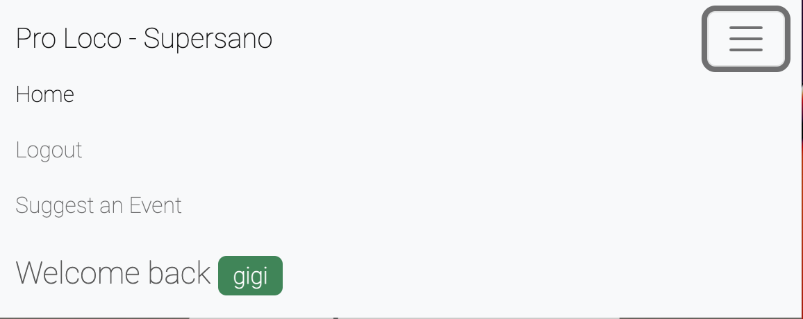
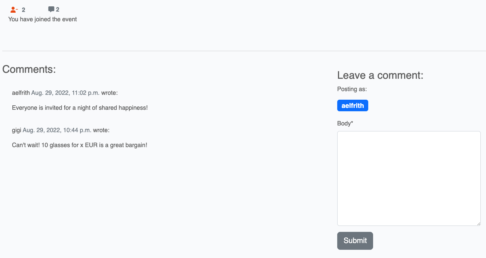

# Pro-Loco Supersano

Pro-Loco Supersano is an NGO based in Supersano - Italy, that gathers resourceful members always striving to organize events for the local community. This web-based app lets them have a general overview on events organized so far. Users visiting the website can interact with the content, depending on their admin rights. 

## Table of Contents
* [User Experience Design (UX)](#User-Experience-Design)
    * [The Strategy Plane](#The-Strategy-Plane)
        * [Site Goals](#Site-Goals)
        * [Agile Planning](#Agile-Planning)
          * [User Stories](#User-Stories)
    * [The Scope Plane](#The-Scope-Plan)
    * [The Structure Plane](#The-Structure-Plan)
      * [Features](#Features)
      * [Future Features](#Features-Left-to-Implement)
    * [The Skeleton Plane](#The-Skeleton-Plane)
        * [Wireframes](#Wireframes)
        * [Database Design](#Database-Design)
        * [Security](#Security)
    * [The Surface Plane](#The-Surface-Plane)
        * [Design](#Design)
            * [Colour Scheme](#Colour-Scheme)
            * [Typography](#Typography)
            * [Imagery](#Imagery)
* [Technologies](#Technologies)
* [Testing](#Testing)
* [Deployment](#Deployment)
    * [Version Control](#Version-Control)
    * [Heroku Deployment](#Heroku-Deployment)
    * [Run Locally](#Run-Locally)
    * [Fork Project](#Fork-Project)
* [Credits](#Credits)
  * [Content](#Content)
  * [Acknowledgements](#Acknowledgements)

# User-Experience-Design

## The-Strategy-Plane

### Site-Goals

The site is aimed to give the NGO an online area where to show, organize, cancel local events, that are accessible to people that - otherwise - would not be able to view their events on other platforms. Moreover, as part of their policy, Pro-Loco Supersano also fosters active participation within the local community, turning into a chance to come up with one's suggestions via a dedicated form.

Eventually, users with admin rights (the staff) can approve both messages left on event pages and proposed events.

### Agile Planning

This project was developed using agile methodologies, by delivering small features (issues). Tasks have been prioritized differently - based on their importance.

All issues were assigned to a project, prioritized under the labels, Must have, Should have, Could have, good first issue. They were handled according to complexity. "Must have" stories were completed first, "should haves", "could haves", and "good first issue" seen as features that visiting users would have seen first on the home page - a blend of higher priority and user-oriented experience. It was done this way to ensure that all core requirements were completed first, while additional features enriching the user experience would have been added gradually.

The Kanban board was created using github projects and can be located [here](https://github.com/users/aelfrith92/projects/2/views/1?layout=board). It can be viewed to see more information on the project cards. Some stories have a set of acceptance criteria in order to define the functionality that marks that story as complete. Some other stories do not have acceptance criteria, as they were considered self-explanatory.

#### User Stories

The following user stories were completed over time. Basic setup stories - such as development-related ones - have been omitted, to prioritize those strictly pertaining the end-user experience. The categories of users described below are "Site User" - meant as a non-authenticated user OR an authenticated user without staff/admin rghts, "admin or privileged user" - meant as an authenticated user, that can be part of the staff. If someone is an admin, but not part of the staff, they may not have access to certain features and might need to access the Django admin overview.

**Customer's statement**

Done - As the president of the association Pro-Loco Supersano, I would like a home page, where members and non-members can find information about our activities and initiatives

**Authentication**

Done - As a Site User I can register an account, so that I can leave comments and my intention to join events

**Pagination and first impression**

Done - As a Site User I can view a list of events with a short preview, so that I can select one to read about

Done - As a Site User I can view a paginated list of events, so that I can easily select an event to view

**Interactions**

Done - As a Site User I can click on an event in the home page, so that I can read about details: whereabouts, whenabouts, etc.

Done - As a Site user I can leave comments on single event pages, so that I can interact with other site users

Done - As a Site user I can join / remove participation to single events, so that I can let other users know that I am going to join an event

As a site user I can receive a notification banner at the top when an action was performed/processed successfully, so that I can have certainty of submitted data

As a Site user I can suggest an event, so that I can feel involved in the local community

As a site authenticated user I can suggest events and get warnings when I am trying to submit an overlapping event, so that I get more chances to see my suggestion approved

**Admin/staff actions**

As a site admin or privileged user (part of the staff) I can edit events, so that I can organize them better.

As a site admin or privileged user (part of the staff) I can delete events, so that get rid of unwanted records in the database.

As a Site Admin I can create, read, update posts, so that I can manage my blog content.

**Documentation**

Tasks:

* Complete readme documentation
* Complete testing documentation write up

## The-Scope-Plan

* Responsive Design - Site should be fully functional on all devices from 320px up
* Hamburger menu for mobile devices
* Ability to perform CRUD functionality on events - admins; Create/Suggest + Read for standard authenticated users
* Restricted role based features
* Home page with list of events

## The-Structure-Plan

### Features

``CUSTOMER'S STATEMENT - As the president (owner) of the association Pro-Loco Supersano, I would like a home page, where members and non-members can find information about our activities and initiatives``

Within the statement, there are a series of taken-for-granted features that should cover essential home page components, such as the navigation menu at the top.

Implementation:

**Navigation Menu**

 The Navigation contains links for Home, allauth options, suggestions (event creation for all authenticated users).

The following navigation items are available on all pages:
  * Home -> index.html - Visible to all
  * Login -> login.html - Visible to logged out users
  * Register -> signup.html - Visible to logged out users
  * Logout -> logout.html - Visible to logged in users
  * Suggest an event -> suggestion.html - Visible to logged in users

The navigation menu is displayed on all pages and drops down into a hamburger menu on smaller devices. This will allow users to view the site from any device and not take up too much space on mobile devices. 

There is a Welcome message on the right side of the navigation bar, which is moved to the bottom on mobile devices burger views:

``USER STORY - As a Site User I can view a list of events with a short preview, so that I can select one to read about``

``USER STORY - As a Site User I can view a paginated list of events, so that I can easily select an event to view``

Implementation:

**Home Page**

The home page contains a hero carousel, depicting members of the staff, a local farmer with the picturesque hill behind the dust, and some characters of the movie "La grande guerra del Salento", shot in Supersano. These will give the user an idea about the cultural content available on the website. Each image contains a different message that adds up to the user's initial assumption about the website content and objective.

Under the carousel, users can see the list of events that are actually confirmed and scheduled. Pagination options limit them to 6 per page. Example without authentication below:

This is the version of the same list when users are authenticated and marked as part of the staff:

Buttons "Update" and "Delete" can be viewed attached to each event by staff users only.

**Footer**

A footer has been added to the bottom of the site, this contains Youtube, Instagram, and Facebook links so that users can follow the restaurant on social media if they want to keep up to date with updates. These icons have aria-labels added to ensure users with assistive screen reading technology know what the purpose of the links are for. They also open in new tabs as they lead users away from the site.

At the bottom, presence on social networks can be found:

``USER STORY - As a Site User I can register an account, so that I can leave comments and my intention to join events``

**Registration**

If visiting users wish to add their participation to events, comment, or suggest new ideas for future events, it can be done by registering first. Once the link "Register" on the nav menu is clicked, the public user is redirected to the registration form:

The user will need to enter a unique username to sign up successfully, as well as an acceptable password with minimum security requirements - i.e. it cannot be set to "temporary".

``USER STORY - As a Site User I can click on an event in the home page, so that I can read about details: whereabouts, whenabouts, etc.``

**View Event Details**

Public users can click on events and view their dedicated page: The small poster picture employed in the home page is here extended to a larger image combined with the event details:

Event information will include date, time, short description (text preview/summary), description, picture.

`` USER STORY - As a Site user I can join / remove participation to single events, so that I can let other users know that I am going to join an event``

**Join/Unjoin Event Button**

Authenticated users can let the staff know that they are going to join the event, by clicking/tapping on the related icon wit the "+" (plus) sign:

As soon as the button is clicked, it changes its form to the same icon, but with the sign "-" (minus) and a message confirming participation just beneath:

To unjoin the event, the user will just need to re-click or re-tap.

`` USER STORY - As a Site user I can leave comments on single event pages, so that I can interact with other site users``
**Leaving Comments**

Authenticated users can leave comments: Staff users get their comments approved as soon as they submit them, standard users need to wait for approvals instead:

While comments are styled as follows when these have been approved:

A badge confirms the username of the person who is leaving a comment, while the icon about comments indicate the quantity of those approved and listed beneath it.